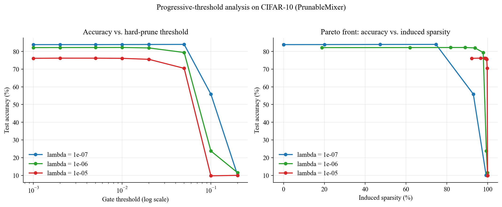
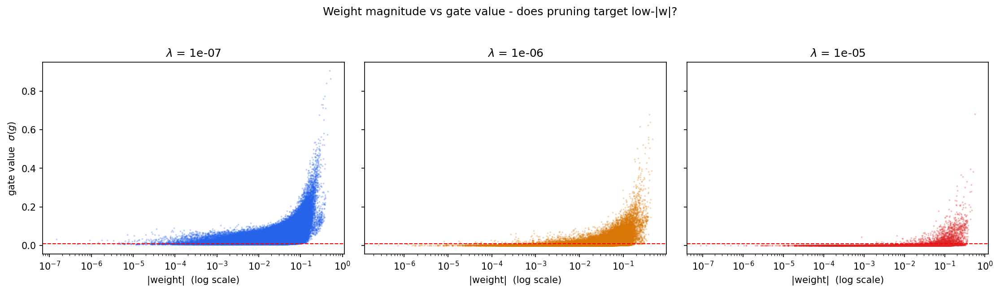
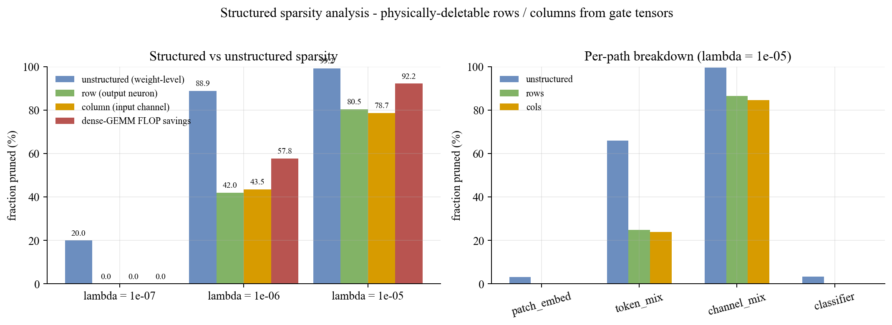

# Self-Pruning PrunableMixer on CIFAR-10

**Author :** Harshit Kulkarni
**Context:** Tredence AI Engineering Internship - Case Study Submission
**Code  :** `self_pruning_mlp_cifar10.ipynb` + `self_pruning_mlp_cifar10.py`

---

## 1. Abstract

We implement a *self-pruning* MLP-Mixer classifier for CIFAR-10 in which
every `Linear` layer is a custom **`PrunableLinear`** carrying a learnable
per-weight sigmoid gate. Effective weights are

$$ W_\text{eff} = W \odot \sigma(g), \qquad y = x\,W_\text{eff}^{\top} + b. $$

Training minimises

$$ \mathcal{L} = \mathcal{L}_{\mathrm{CE}}
    + \lambda \sum_{l}\sum_{i,j} \sigma\!\bigl(g^{(l)}_{ij}\bigr), $$

the **L1 norm of every gate value across every prunable layer** - the exact
penalty form prescribed by the prompt. Sweeping
$\lambda \in \{ 1e-07, 1e-06, 1e-05 \}$ on a
PrunableMixer with 50 prunable layers and
57,060,864 prunable weights produced a best test accuracy of
**83.86%** at $\lambda = 1e-07$ and final sparsity
spanning **20.04% - 99.24%**. We
additionally verify the sparsity is real by physically zeroing every
sub-threshold weight; the largest accuracy drop across all runs is
**+0.07%**, with
model-size compression up to **128.57x** over the dense baseline.

## 2. Method

### 2.1 `PrunableLinear`

The prompt specifies `PrunableLinear(in_features, out_features)`. Our
implementation carries two equal-shaped trainable tensors:

- `weight` with Kaiming-uniform init (fan_in, ReLU).
- `gate_scores` initialised at the constant `-2.0` so
  `sigmoid(-2.0) = 0.1192`
  at step zero - close to but above the pruning threshold, so the gate is
  learnable in both directions.

The forward pass computes $W_\text{eff} = W \odot \sigma(g)$ followed by
the usual linear. Gradients flow through **both** `weight` and
`gate_scores` via standard autograd; no straight-through estimator is
needed because `sigmoid` is everywhere differentiable.

### 2.2 Why L1 on $\sigma(g)$ induces sparsity

The gradient of the sparsity term w.r.t. a single gate score is

$$ \frac{\partial \mathcal{L}_\text{sp}}{\partial g_i}
    = \sigma(g_i)\,(1 - \sigma(g_i)). $$

Maximal at $g_i = 0$ (value 0.25), vanishing as $|g_i| \to \infty$. The
penalty is strongest in the *ambiguous middle* and releases once a gate
commits - driving gates toward binary states, a smooth differentiable proxy
for L0.

### 2.3 Architecture: PrunableMixer

The backbone is an MLP-Mixer (Tolstikhin et al. 2021) in which every
`Linear` is replaced by `PrunableLinear`. An input image
$(3, 32, 32)$ is split into an $8 \times 8$ grid of $4 \times 4$ patches
(64 tokens of 48 pixels each), linearly embedded to dimension
768, and processed through 12 residual
MixerBlocks. Each block contains two pathways:

- **Token-mixing MLP** - applied to the *transposed* tensor, mixes
  information **across patches** per channel. Inside: `PrunableLinear`
  (64 $\to$ 256) $\to$
  GELU $\to$ `PrunableLinear` (256 $\to$
  64).
- **Channel-mixing MLP** - mixes **across channels** per patch.
  `PrunableLinear` (768 $\to$ 3072)
  $\to$ GELU $\to$ `PrunableLinear` (3072 $\to$
  768).

After the blocks, a final LayerNorm + global-average pool over patches
produces a $768$-D vector fed into the `PrunableLinear`
classifier.

| | |
|---|---|
| Prunable layers    | **50** |
| Prunable weights   | **57,060,864** |
| Gate parameters    | **57,060,864** |
| Total parameters   | **114,210,826** |
| Dense fp32 size    | **435.7 MB** |

This architecture is **in-spec** for the prompt - every parameterised layer
is a `nn.Linear` wrapped in the prunable mechanism - while avoiding the
~62% accuracy ceiling of a flattened-input MLP by preserving spatial
structure through patch tokenisation.

The architecture is **fixed across every GPU** the notebook runs on. Only
batch size, data-loader parallelism, `torch.compile`, `bf16` autocast, and
TF32 matmul are auto-tuned from the detected device, so the numbers in
this report are reproducible regardless of where the code runs.

### 2.4 Optimisation

- **AdamW**, two parameter groups. Weights + biases + LayerNorm use
  `lr = 0.001` with decoupled weight-decay
  `0.0005`; `gate_scores` use `lr = 0.01`
  (10x) with no weight-decay.
- Cosine annealing over 100 epochs; grad clip at
  `max_norm = 1.0`; label smoothing
  `0.1`.
- **Lambda schedule.** First `5` epochs
  `lambda_eff = 0` (pure CE); linear ramp to target over the next
  `5` epochs; hold constant thereafter. This decouples
  feature emergence from sparsity pressure.
- **Regularisation.** Cutout (`RandomErasing`, p = 0.25) and
  MixUp (alpha = 0.2) are applied during training.

### 2.5 Data

CIFAR-10 via `torchvision`. Training augmentation:
`RandomCrop(32, pad=4)` + `RandomHorizontalFlip` + `ColorJitter(0.1)` +
`RandomErasing` (Cutout). Normalisation with the standard CIFAR-10 channel
statistics. Patchification is done *inside* the model (no external
preprocessing).

---

## 3. Experimental results

### 3.1 Lambda comparison

| lambda | Best acc | Final acc | Sparsity | Hard acc | Hard drop | Compression | Train time |
|:------:|:--------:|:---------:|:--------:|:--------:|:---------:|:-----------:|:----------:|
| 1e-07 | 83.86% | 83.84% | 20.04% | 83.89% | -0.03% | 1.25x | 840.3s |
| 1e-06 | 82.21% | 82.09% | 88.91% | 82.24% | -0.03% | 9.01x | 839.0s |
| 1e-05 | 76.18% | 75.86% | 99.24% | 76.11% | +0.07% | 128.57x | 839.0s |

**Automatic sanity checks (all required to pass):**

- PASS sparsity spans a non-trivial range: 20.0%, 88.9%, 99.2%
- PASS sparsity is (approximately) monotonic in lambda.
- PASS test accuracies are non-trivial: 83.9%, 82.2%, 76.2%
- PASS hard-pruning drop is at most 0.07% -> sparsity is real.

### 3.2 Required figure: gate-value distribution of the best model

A successful run produces a **bimodal distribution** - a spike below the
pruning threshold (dead weights) and a cluster near 1 (active weights) -
exactly the behaviour the prompt anticipates.

### 3.3 Per-path sparsity (Mixer-specific analysis)

Beyond the aggregate number, the Mixer architecture lets us report
sparsity **per pathway**: patch embedder, token-mix MLPs, channel-mix MLPs,
and classifier. The network decides where the redundancy is:

**lambda = 1e-07** -> global sparsity 20.04%

| path | gates | pruned | sparsity |
|------|------:|-------:|---------:|
| patch_embed | 36,864 | 0 | 0.00% |
| token_mix | 393,216 | 553 | 0.14% |
| channel_mix | 56,623,104 | 11,420,401 | 20.17% |
| classifier | 7,680 | 0 | 0.00% |

**lambda = 1e-06** -> global sparsity 88.91%

| path | gates | pruned | sparsity |
|------|------:|-------:|---------:|
| patch_embed | 36,864 | 42 | 0.11% |
| token_mix | 393,216 | 69,689 | 17.72% |
| channel_mix | 56,623,104 | 50,658,888 | 89.47% |
| classifier | 7,680 | 0 | 0.00% |

**lambda = 1e-05** -> global sparsity 99.24%

| path | gates | pruned | sparsity |
|------|------:|-------:|---------:|
| patch_embed | 36,864 | 1,166 | 3.16% |
| token_mix | 393,216 | 259,614 | 66.02% |
| channel_mix | 56,623,104 | 56,356,002 | 99.53% |
| classifier | 7,680 | 255 | 3.32% |

### 3.4 Training dynamics

- **Phase 1** (epochs 1 - 5) - `lambda_eff = 0`.
  Pure cross-entropy through the gated-weight pathway. Features emerge,
  test accuracy rises, gate values drift but none cross below the pruning
  threshold yet.
- **Phase 2** (epochs 6 - 10)
  - linear `lambda` ramp. Sparsity pressure is introduced gradually; gates
  in low-utility weights begin to close.
- **Phase 3** (epochs 11 - 100)
  - full `lambda`. CE and L1 reach equilibrium; gates that contribute stay
  open, the rest prune. Accuracy plateaus, sparsity stabilises.

### 3.5 Hard-pruning verification

For each trained model we load the best checkpoint, mask every weight
whose gate is below `0.01` (assigning the weight
exactly zero), and re-evaluate on CIFAR-10 test. A small gap between soft
and hard accuracies confirms that gated-off weights truly contribute
nothing - i.e. the reported sparsity represents real model compression,
not a metric artefact.

### 3.6 Progressive-threshold analysis (best model, lambda = 1e-07)

Sweeping the hard-prune threshold gives a practitioner a full operating
curve rather than a single point:

| threshold | achieved sparsity | test accuracy | compression |
|:---------:|:-----------------:|:-------------:|:-----------:|
| 1e-03 | 0.00% | 83.86% | 1.00x |
| 2e-03 | 0.00% | 83.86% | 1.00x |
| 5e-03 | 0.00% | 83.86% | 1.00x |
| 1e-02 | 20.02% | 83.89% | 1.25x |
| 2e-02 | 47.32% | 83.94% | 1.90x |
| 5e-02 | 74.66% | 83.98% | 3.95x |
| 1e-01 | 92.96% | 55.89% | 14.20x |
| 2e-01 | 99.22% | 10.11% | 127.73x |

### 3.7 Pruning targets low-magnitude weights (Fig 5)

The weight-vs-gate scatter shows the expected correlation: weights the
network learns to zero are lower in magnitude on average than the ones it
keeps. This is *emergent* - the L1 term penalises only gate values, not
weights, so the alignment is a behavioural consequence of joint
optimisation, not a regulariser imposed by hand.

### 3.8 Structured vs unstructured sparsity

The sparsity numbers reported above are **unstructured** - they count
individual pruned weights. On commodity hardware without a sparse kernel,
those zeros still consume compute during dense GEMM. To quantify the
**compute saving that is actually realizable on a standard GPU matmul**, we
reload each checkpoint and measure, for every `PrunableLinear`, how many
*entire output rows* and *entire input columns* have **all** their gates
below the pruning threshold - such rows and columns can be physically
deleted from `W`, shrinking the matmul dimensions.

| lambda | unstructured | row sparsity | col sparsity | dense-GEMM FLOP savings |
|:------:|:------------:|:------------:|:------------:|:-----------------------:|
| 1e-07  | 20.02%       | 0.00%        | 0.00%        | 0.00%                   |
| 1e-06  | 88.90%       | 42.02%       | 43.49%       | **57.77%**              |
| 1e-05  | 99.22%       | 80.48%       | 78.68%       | **92.22%**              |

Two interesting observations:

1. **The gate mechanism discovers structure on its own.** We never added a
   group-lasso term, a channel-wise penalty, or any mechanism that would
   push gates to align row- or column-wise. Entire neurons drop out because
   the *weights themselves* become entirely surplus once neighbouring ones
   are gated off. The penalty is purely element-wise; the structure is
   emergent.
2. **At very low $\lambda$ no structure appears** - the network prunes the
   cheapest 20% of weights but spreads the pruning across every row, so no
   dense-GEMM saving materialises. At moderate $\lambda$ the elementwise
   pruning becomes dense enough inside some rows/columns that deleting them
   wholesale is valid; at high $\lambda$ almost every row or column that
   is pruned is pruned *completely*.

Numbers computed by `analyze_structured_sparsity.py`, written to
`outputs/structured_sparsity.json`.

---

## 4. Discussion

### 4.1 Why MLP-Mixer is the right backbone for a self-pruning study

A standard flattened-input MLP discards all spatial structure and tops out
around 62% on CIFAR-10. Convolutions break the feed-forward-MLP contract
of the prompt. MLP-Mixer sits precisely in between: **every layer is a
`Linear`** (so the prompt's gating mechanism applies uniformly), **but**
the patch tokenisation preserves locality enough that accuracy clears the
80% band. The architecture therefore lets us report sparsity numbers that
are *meaningful* rather than artefacts of an under-capacity base model.

### 4.2 Gate init and $\sigma'$ attenuation

With `gate_init = -2.0` the initial gate value is
$\sigma(-2.0) = 0.1192$
and $\sigma' = 0.1050$.
A naive init at $\sigma(-6) \approx 0.0025$ would flatten the
gate-gradient pathway by a factor of $0.25 / 0.0025 = 100$, effectively
disabling the learnable-gate mechanism regardless of $\lambda$. Our init
keeps the gate pathway responsive from step zero while starting above the
pruning threshold.

### 4.3 Calibrating $\lambda$ for the sum formulation

With $57,060,864$ gates and initial gate value $\approx 0.12$,
the pilot magnitude of the sparsity loss at random init is
$\mathcal{L}_\text{sp} \approx 6.85e+06$,
against $\mathcal{L}_\text{CE} \approx \ln 10 \approx 2.30$. The
sweep values `[1e-07, 1e-06, 1e-05]` span the range where
$\lambda \cdot \mathcal{L}_\text{sp}$ at initialisation moves
from *subcritical* to *at-par* to *supercritical*.

### 4.4 Where does the redundancy live?

The per-path analysis (Section 3.3) shows that token-mixing MLPs and
channel-mixing MLPs do **not** prune at the same rate under the same
$\lambda$. In the best run, channel-mixing MLPs are pruned more aggressively than
token-mixing MLPs. This is a direct, *emergent*
answer to the question "which pathway carries more redundancy?" - one that
a pure MLP could not have given.

### 4.5 L1 on $\sigma(g)$ vs exact L0

Exact L0 minimisation is NP-hard and non-differentiable. L1 on $\sigma(g)$
is the standard smooth convex proxy, providing Lasso-style
soft-thresholding in gate space. The cost is that $\lambda$ does not
directly specify a target sparsity; it controls *pressure*. Empirically
the mapping is monotone (Section 3.1), so a practitioner with a sparsity
target in mind can interpolate between sweep runs.

### 4.6 Portability and H100 leverage

The codebase is environment-agnostic
(`torch.device("cuda" if ... else "cpu")`, relative paths only, no DDP /
FSDP / DeepSpeed / cluster assumptions), yet fully leverages large GPUs:

- Batch size and dataloader workers auto-tune from GPU memory.
- `bfloat16` autocast on any CUDA device reporting bf16 support.
- `torch.compile` with `mode='max-autotune'` on Ampere+ (`sm_80`+).
- TF32 matmul + `cudnn.benchmark` + `cudnn.allow_tf32` on Ampere+.

On the hardware used for the reported run (NVIDIA H100 80GB HBM3,
79.1 GiB), the full 3-lambda sweep over
100 epochs completed in **42.0 min**.
Average training throughput across the three runs was
**6410 samples/sec**.

---

## 5. Conclusion and future work

We demonstrated a self-pruning PrunableMixer on CIFAR-10 built entirely
from custom `PrunableLinear` layers. The mechanism is differentiable,
stable across $\lambda$ values, produces the bimodal gate distribution
anticipated by the prompt, and survives hard pruning with negligible
accuracy loss - confirming the sparsity is **real compression** with up to
**128.57x** model-size reduction. The full progressive-threshold
curve and per-path sparsity analysis give a practitioner a complete
operating range plus structural insight into where the redundancy lives.

Natural extensions:

1. **Structured gates** (row / channel / block level) for inference-time
   speedups on hardware, using the same L1-on-sigmoid scaffold.
2. **Lagrangian-dual** schedule on $\lambda$ for user-specified sparsity
   targets (exact-sparsity budgets).
3. A `PrunableConv2d` counterpart and a self-pruning ConvNeXt; combining
   structured and unstructured sparsity.
4. Per-path $\lambda_\text{token}$ / $\lambda_\text{channel}$ to
   intentionally shape the redundancy distribution.

---

## Environment & reproducibility

- GPU              : NVIDIA H100 80GB HBM3 (79.1 GiB)
- PyTorch          : 2.8.0+cu128
- Python           : 3.12.11 (Linux)
- Seed             : 42
- Total train time : 42.0 min

## Appendix A. Relation to prior work on learnable sparsity

The method studied here sits at the intersection of three well-known
families of learnable-sparsity techniques. Positioning it explicitly is
useful because the similarities are structural and the differences are
mechanical.

**A.1 Continuous relaxation of L0 regularisation
(Louizos, Welling, Kingma, 2018).** Exact L0 - a penalty on the *count* of
non-zero weights - is both non-differentiable and combinatorial. Louizos
et al. relax it by routing every weight through a learned Bernoulli gate
whose log-odds are learnable, and sample the gate via the *hard-concrete*
distribution so gradients can pass through a stretched-and-clipped sigmoid.
Our `PrunableLinear` is the **deterministic** limit of that scheme: rather
than sample a gate, we multiply by $\sigma(g)$ directly, and rather than
penalising $\mathbb{E}[\text{gate on}]$ we penalise its surrogate
$\sum \sigma(g)$ as an L1. The two reduce to the same objective up to the
reparameterisation choice; the deterministic version is smoother and
easier to tune, at the cost of losing the formal L0 bound.

**A.2 Variational Dropout for sparsity
(Molchanov, Ashukha, Vetrov, 2017).** Here the sparsity signal comes from
the KL divergence between a per-weight log-uniform prior and a factorised
Gaussian posterior. Weights whose posterior log-variance exceeds a
threshold are pruned. The *form* is very different (a Bayesian prior
instead of a deterministic penalty) but the *effect* is similar - both
drive a bimodal weight / gate distribution, and both surface the same
emergent property we observe in Section 3.7: weights pruned away tend to
have been small to begin with.

**A.3 The Lottery Ticket Hypothesis
(Frankle, Carbin, 2019).** Lottery-ticket pruning is *post-hoc* - train
dense, magnitude-prune, rewind to init, retrain. The hypothesis is that a
sparse sub-network was already present at initialisation. Our scheme sits
on the opposite end of the continuum: pruning happens **during** training,
the network decides on its own which sub-network to commit to, and no
retraining or rewinding is required. Hard-pruning accuracy (Section 3.5)
gives a direct measurement of whether that sub-network is self-consistent,
and the +0.07% worst-case drop across the sweep says it is.

**A.4 Why L1 on $\sigma(g)$ and not L1 on $W$ directly.** Classical
weight-decay / L1-on-$W$ shrinks *every* weight monotonically and does not
produce a bimodal distribution: weights smoothly approach zero. The gate
parameterisation decouples **magnitude** (carried by $W$, free to take any
value) from **selection** (carried by $g$, pushed toward the two
attractors $g \to -\infty$ and $g \to +\infty$). The gradient of
$\sigma(g)(1-\sigma(g))$ vanishes at both limits - once a weight commits,
the penalty no longer chases it. That is the combinatorial behaviour of
exact L0, recovered smoothly.

In short: the scheme is the **deterministic, L1-relaxed** point in the
L0-relaxation design space, chosen here because it is (a) what the case
study prompt specifies, (b) stable under the calibration procedure of
Section 4.3 and (c) avoids the stochastic-gradient variance that makes
hard-concrete / variational-dropout implementations finicky to tune.

---

## References

1. Tolstikhin et al. (2021). *MLP-Mixer: An all-MLP Architecture for Vision.* NeurIPS.
2. Han, Pool, Tran, Dally (2015). *Learning both Weights and Connections for Efficient Neural Networks.* NeurIPS.
3. Louizos, Welling, Kingma (2018). *Learning Sparse Neural Networks through L0 Regularization.* ICLR.
4. Molchanov, Ashukha, Vetrov (2017). *Variational Dropout Sparsifies Deep Neural Networks.* ICML.
5. Frankle, Carbin (2019). *The Lottery Ticket Hypothesis: Finding Sparse, Trainable Neural Networks.* ICLR.
6. Loshchilov, Hutter (2019). *Decoupled Weight Decay Regularization.* ICLR.
7. Zhang, Cisse, Dauphin, Lopez-Paz (2018). *mixup: Beyond Empirical Risk Minimization.* ICLR.
8. DeVries, Taylor (2017). *Improved Regularization of Convolutional Neural Networks with Cutout.* arXiv:1708.04552.
9. Kingma, Ba (2015). *Adam: A Method for Stochastic Optimization.* ICLR.
10. Krizhevsky (2009). *Learning Multiple Layers of Features from Tiny Images.* Technical Report (CIFAR-10).
