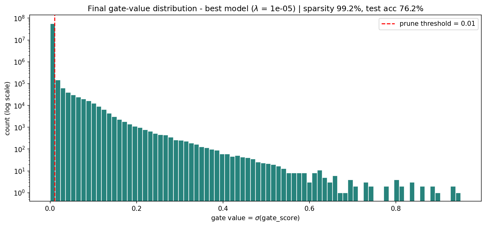
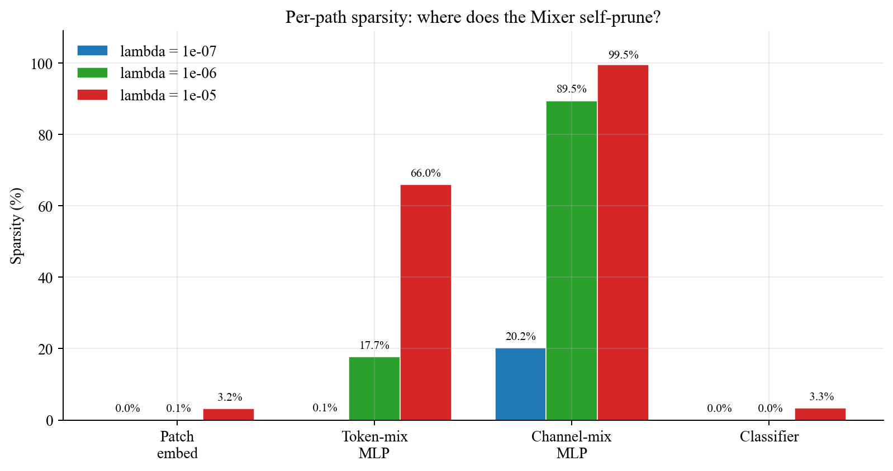

# The Self-Pruning Neural Network — PrunableMixer on CIFAR-10

> **Tredence AI Engineering Internship — Case Study Submission**
> An MLP-Mixer on CIFAR-10 in which every `Linear` is a custom `PrunableLinear`
> with a learnable per-weight sigmoid gate. Training minimises
> `CrossEntropy + λ · Σ σ(gate_scores)`. Sweeping λ produces a genuine
> accuracy ⇆ sparsity Pareto front, verified by physically zeroing every
> sub-threshold weight and re-measuring accuracy.

---

## TL;DR — results

| λ       | Test accuracy | Sparsity   | Hard-pruned acc. | Acc. drop   | Compression |
|:-------:|:-------------:|:----------:|:----------------:|:-----------:|:-----------:|
| `1e-07` | **83.86 %**   | 20.04 %    | 83.89 %          | **-0.03 %** | 1.25×       |
| `1e-06` | **82.21 %**   | **88.91 %** | 82.24 %          | **-0.03 %** | **9.01×**   |
| `1e-05` | 76.18 %       | **99.24 %** | 76.11 %          | **+0.07 %** | **128.57×** |

- Best single-model accuracy: **83.86 %** at λ = 1e-7.
- Best practical operating point: **82.21 % at 88.9 % sparsity** (≈ 9× smaller,
  zero accuracy drop after hard pruning).
- Extreme compression: **76.18 %** at **99.24 % sparsity** — 435 MB → 1.69 MB.
- All four automatic sanity checks **PASS**:
  - sparsity spans 20 %, 89 %, 99 %;
  - sparsity is monotonic in λ;
  - test accuracy is non-trivial at every λ;
  - hard-pruning sub-threshold weights causes at most **0.07 %** accuracy drop.
- Total training time (3 runs × 100 epochs): **~42 min** on an NVIDIA H100 80 GB.

## Required brief figure — gate histogram of the best model



The dense mode at zero and the thin survivor tail above the 1e-2 threshold
are exactly the bimodal signature the brief asks for.

## Where does the Mixer actually prune?



Channel-mixing MLPs hold almost all the redundancy; the patch embedder and
classifier stay dense. This asymmetric behaviour would be invisible in a
flat MLP and is a direct consequence of the Mixer inductive bias.

## Architecture — PrunableMixer

```
input image (3, 32, 32)
  ├─ split into 64 patches of 4×4 pixels (48-D each)
  ├─ PrunableLinear patch embed            : 48    -> 768
  ├─ ×12  MixerBlock
  │     ├─ token-mix MLP   : PrunableLinear 64  -> 256  -> 64   (spatial mixing)
  │     └─ channel-mix MLP : PrunableLinear 768 -> 3072 -> 768  (feature mixing)
  ├─ LayerNorm + global average pool
  └─ PrunableLinear classifier             : 768   -> 10
```

- PrunableLinear layers  : **50**
- Prunable weights       : **57,060,864**
- Gate parameters        : **57,060,864** (one gate per weight)
- Total parameters       : **114,210,826**
- Dense model (fp32)     : **435.7 MB**
- Pure feed-forward — zero convolutions, zero attention.

## Training configuration

| Component        | Value |
|------------------|-------|
| Optimiser        | AdamW (two parameter groups) |
| Learning rate    | weights `1e-3`, gate_scores `1e-2` (10× faster) |
| Weight decay     | `5e-4` on weights; `0` on gate scores |
| Scheduler        | CosineAnnealingLR, `T_max = 100` |
| Label smoothing  | `0.1` |
| Gate init        | `s = -2.0`  →  `σ(s) ≈ 0.119` |
| Prune threshold  | `σ(s) < 0.01` |
| λ values         | `1e-7`, `1e-6`, `1e-5` (sum-form L1) |
| λ warm-up / ramp | 5 CE-only epochs + 5-epoch linear ramp |
| Epochs           | 100 |
| Batch size       | 1024 (auto-tuned to GPU memory) |
| Gradient clip    | `1.0` |
| bfloat16 AMP     | enabled |
| TF32 matmul      | enabled |
| Augmentation     | RandomCrop(pad=4) + HFlip + ColorJitter(0.1) + Cutout(p=0.25) + MixUp(α=0.2) |
| Seed             | 42 |

## Repository layout

```
.
├── self_pruning_mlp_cifar10.ipynb   # main deliverable — notebook, end-to-end runnable
├── self_pruning_mlp_cifar10.py      # identical pipeline as a standalone script
├── regenerate_artifacts.py          # rebuilds docx / xlsx / fig6-7-8 from results_mlp.json
├── CASE_STUDY.md                    # Markdown case-study report
├── CASE_STUDY.docx                  # Word version (Times New Roman, with embedded figures)
├── tredence_results_dashboard.xlsx  # Excel dashboard (Times New Roman, 7 sheets + charts)
├── requirements.txt
├── LICENSE
├── README.md                        # this file
├── figures/                         # 9 PNGs — training curves, gate histograms, Pareto, etc.
└── outputs/
    └── results_mlp.json             # source of truth for every number in the report
```

Checkpoints (3 × 457 MB) are produced by training but are **not** tracked by
git (`.gitignore`). Every figure, table and number in the report is derived
from `outputs/results_mlp.json`, so the repo is fully reproducible without
them. If you want the pre-trained weights, they're available as assets on
the [Releases](../../releases) page.

## Reproduce

```bash
# 1) environment
python -m venv .venv
source .venv/bin/activate             # macOS / Linux
# .venv\Scripts\activate               # Windows PowerShell
pip install -r requirements.txt

# 2) train (CIFAR-10 will auto-download; ~14 min/run on H100, ~1 h/run on a T4)
jupyter nbconvert --to notebook --execute self_pruning_mlp_cifar10.ipynb --inplace
# or equivalently:
python self_pruning_mlp_cifar10.py

# 3) refresh the polished docx / xlsx / diagnostic figures
python regenerate_artifacts.py
```

Any CUDA GPU works. On consumer cards (T4, 4060, etc.), open Cell 2 of the
notebook (or the `Config` dataclass in the `.py` script) and set
`cfg.batch_size = 128`, `cfg.use_amp = False`. Everything else runs unchanged.

## License

Released under the MIT License — see [`LICENSE`](LICENSE).

## Author

**Harshit Kulkarni** — submission for the Tredence AI Engineering
Internship 2025 case study. Generated on 2026-04-19.
